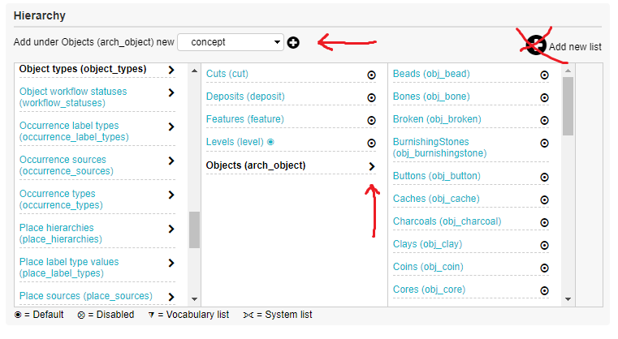

The intructions below are for:

1) adding in new tables, or `Lists` in Collective Access terms, using the CA UI instead of directly editing the xml.
2) creating metadata fields and assigning them to lists
3) adding relationships between models
4) changing what the CA UIs display when adding/editing/viewing CA entries (objects, places, etc)

Don't forget to export your CA profile (using the `Manage -> Administration -> Maintenance -> Export Configuration` page) when you make changes to the lists/etadata/UIs/relationships so that you can rebuild the database without redoing the manual effort in the future!

# Adding new Lists (tables) to Collective Access

Instructions can be found here: https://manual.collectiveaccess.org/providence/user/editing/lists_and_vocab.html

For practical advice on adding sub-tables (such as the various Arch objects, and concepts of AOI/POI/etc under Places)
you need to navigate to the `_type` of the primary table that best suits your sub-table, and then add a new list entry 
to that. 

For instance if you wish to add in a new type of place, navigate to the `place_types` table and then add a new list
item as described in the instructions above.

To add a `sub-type` table underneath an existing type of object, for example a new artefact type underneath the `objects_types -> arch_object` list, navigate to the `_types` list as usual and then click on either the circle or arrow marker to the right of the desired parent table as shown in the image below. Once clicked, double check the text above the navigation box says `add under TABLE (SUB-TYPE) new concept` and make sure the dropdown box says `concept` i.e. `add under Objects (arch_object) new concept`. Click the plus icon next to this text to create the new sub-type.



# Adding new metadata attributes to Collective Access

Please use the instructions here to create new metadata fields and add/restrict them to various tables: https://manual.collectiveaccess.org/providence/user/editing/metadataelements.html


# Adding in relationships between Lists

For any relation between tables to exist there needs to be a `relationship` specified between the two primary tables. If a relationship does not already exist between the two primary tables then I believe they need to be specified explicity using a XML file rather than via the UI.

Fortunately quite a lot of relations already exist, and instructions on creating new relationship types can be found here: https://manual.collectiveaccess.org/providence/user/editing/config_rel_types.html


# Adding and configuring UIs for CA tables

You can customise the view/add/edit UIs of the CA tables and entries by using the CA admin UI. This lets you choose what fields(metadata) are displayed on which pages, and for which objects. There are reasonably complete instructions to explain this UI editing using the CA UI: https://manual.collectiveaccess.org/providence/user/editing/interfaces.html


## Editing the CA home page dashboard

See these instructions for details: https://manual.collectiveaccess.org/providence/user/editing/dashboard.html

The `records by status` widget can be used to get an overview of the editing status of various entries.


## Editing the browse search page to include new options

The browse page of search works by displaying search options known as `facets` that you can quickly query on. The default `facets` are all based upon primary tables + primary attributes and will appear when the type of table has one or more of these attributes used (i.e. you can search by relations once 1 or more examples exist).

It is also possible to configure the browse facet options, even to allow browsing on custom metadata, by editing the `browse.conf` file to specify new facets for given primary tables. Relevant instructions are below:

* https://manual.collectiveaccess.org/providence/user/searchBrowse/browse.html
* https://manual.collectiveaccess.org/providence/user/configuration/mainConfiguration/browse.html

I have created an example of this by adding the `keywords` facet as an option for Object browsing. This was done by adding the following snippet to the object facets in `browse.conf`, and can be done for media files (object_representations) in the same way:

```
keywords_facet = {
    type = attribute,
    element_code = keywords,

    indefinite_article = a,
    label_singular = _(keyword),
    label_plural = _(keywords)
                }
```